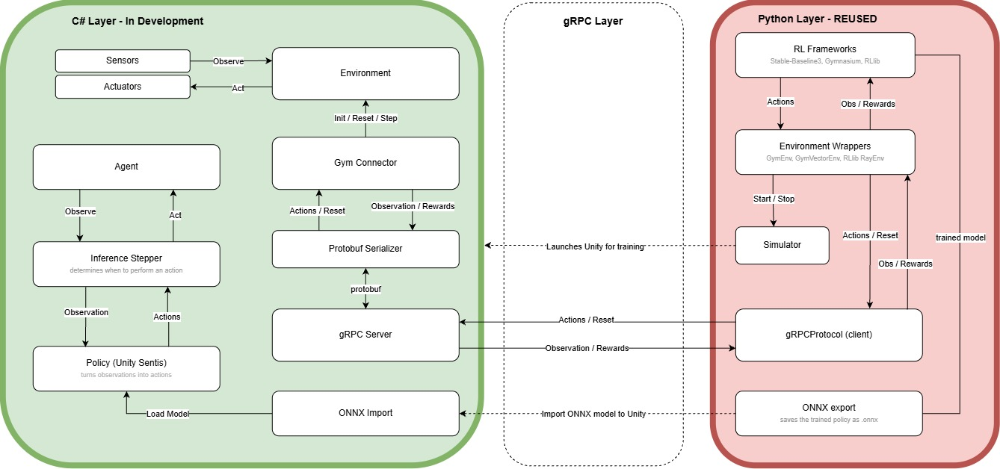
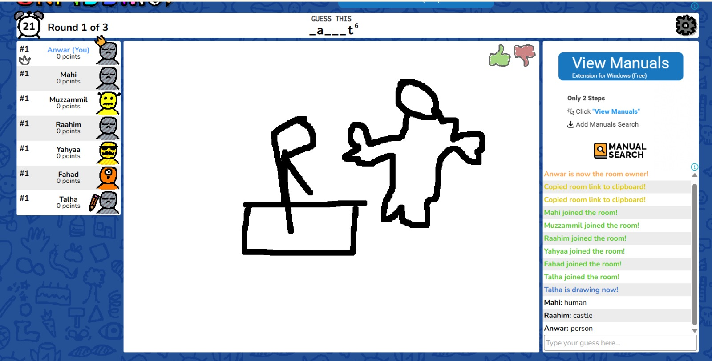

# AMD Schola / Oscorp
> _Note:_ This document will evolve throughout your project. You commit regularly to this file while working on the project (especially edits/additions/deletions to the _Highlights_ section). 
 > **This document will serve as a master plan between your team, your partner and your TA.**

## Product Details
 
#### Q1: What is the product?

We are extending AMD Schola, an open-source reinforcement learning library, by porting its engine integration from Unreal Engine to Unity, making Schola available to Unity developers.

Reinforcement learning lets an agent, such as a game character, learn through trial and error by getting rewards for useful actions. Schola already connects Unreal Engine to popular Python training tools like Gymnasium, Stable-Baselines3 and RLlib. Unity has no equivalent support, so Unity developers have to build that connection themselves. Our Unity port will let them set up environments and agents in their scenes, train those agents with Schola's existing Python tools, and run the trained models in their games.

Our partner is AMD, a company that develops high-performance microprocessors and graphics processors. Our partner representatives are Alexander Cann, Member of Technical Staff, and TianYue Liu, Senior Software Engineer, both on AMD's Schola team. Alexander is our primary point of contact.

#### Q2: Who are your target users?

Our primary users are Unity game developers who want to train NPCs or simulation agents without building their own connection to reinforcement learning tools. This includes developers at small game studios who can build scenes and character behaviours but need support integrating agent training into their games.

We also target reinforcement learning researchers and engineers who already use Schola and want to work with Unity environments while keeping their existing training tools.

#### Q3: Why would your users choose your product? What are they using today to solve their problem/need?

Unity developers can currently use Unity ML-Agents or build custom training integrations. Users would choose our product when they want to use Schola’s existing tools within Unity, especially if they already work with Schola in Unreal Engine.

The main advantage over Unity ML-Agents would be compatibility with Schola’s training workflow. Teams could keep familiar tools while working across both engines, and Unity developers would not need to build the Schola connection themselves. Our package aims to reduce repeated integration work while fitting into Unity’s existing editor workflow. This supports AMD’s plans to make Schola available across multiple game engines.

#### Q4: What are the user stories that make up the Minumum Viable Product (MVP)?

Partners agreed on user stories in earlier meetings.

The following user stories outline the requirments for the MVP. These will allow a Unity developer to create a RL environment, train through Schola's Python ecosystems, export the trained model in an ONNX policy, then run it in Unity without Python. 

##### US1. Define agent inputs

**Story:** As a Unity game developer, I want to configure what an agent observes so that it can make decisions using relevant game information.

**Acceptance Criteria:**

- Observation values update with the scene.
- Observation values keep a consistent format.

##### US2. Apply agent actions

**Story:** As a Unity game developer, I want to connect policy outputs to game actions so that the trained agent can control a game object.

**Acceptance Criteria:**

- Valid actions change the object’s behaviour.
- Invalid actions produce a clear error.

##### US3. Control training episodes

**Story:** As an RL engineer, I want to define rewards, episode endings, and resets so that the agent can learn from repeated attempts.

**Acceptance Criteria:**

- The environment reports rewards and episode status to Python.
- The environment resets correctly for the next episode.

##### US4. Train through Schola

Story: As an RL engineer, I want to connect my Unity environment to Schola’s existing Python tools so that I can train agents without writing a custom training connection.

**Acceptance Criteria:**

- Unity exchanges observations and actions through Schola’s existing communication contract.
- A short training run completes successfully.

##### US5. Run a trained policy

**Story:** As a Unity game developer, I want to load a compatible trained model so that my agent can act during gameplay without a separate Python process.

**Acceptance Criteria:**

- Unity loads the model.
- Unity supplies observations.
- Unity applies its actions with Python stopped.

##### US6. Set up the integration

**Story:** As a Unity game developer, I want a setup guide and sample scene so that I can install the package and adapt it to my own project.

**Acceptance Criteria:**

- A new team member can follow the guide to run training.
- A new team member can then use a trained model in Unity.

#### Partner review

We will send the artifact and the architecture to AMD partners using our Microsoft team channel.
Proof of communication and any changes will be added here.

#### Q5: Have you decided on how you will build it? Share what you know now or tell us the options you are considering.

**Technology Stack:** C# for the Unity plugin and Python 3.10–3.12 for Schola’s existing training client. gRPC/Protobuf for communication; Gymnasium, Ray RLlib, and Stable-Baselines3 for training; ONNX and Unity Sentis for model import and inference.

**Deployment:** Distributed as a Unity Package Manager (UPM) package through a Git URL or tarball, with a sample project, tests, and README. Developers install it in their Unity projects and include local inference in their game builds. No web hosting or PaaS is required.

**Architecture:**

The C# layer contains environments, sensors, actuators, and agents. For training, a Gym Connector and gRPC/Protobuf service exchange actions, observations, and rewards with Schola’s reused Python tools. For local inference, an inference stepper controls when the Unity Sentis policy runs an imported ONNX model and returns actions to the agent, without Python.

**Third-Party Applications & APIs:** Schola’s existing Python APIs, Gymnasium, Ray RLlib, Stable-Baselines3, and Unity Sentis. Communication dependencies under consideration include Google.Protobuf, Grpc.Tools, and YetAnotherHttpHandler.

----
## Intellectual Property Confidentiality Agreement 
> Note this section is **not marked** but must be completed briefly if you have a partner. If you have any questions, please ask on Piazza.
>  
**By default, you own any work that you do as part of your coursework.** However, some partners may want you to keep the project confidential after the course is complete. As part of your first deliverable, you should discuss and agree upon an option with your partner. Examples include:
1. You can share the software and the code freely with anyone with or without a license, regardless of domain, for any use.
2. You can upload the code to GitHub or other similar publicly available domains.
3. You will only share the code under an open-source license with the partner but agree to not distribute it in any way to any other entity or individual. 
4. You will share the code under an open-source license and distribute it as you wish but only the partner can access the system deployed during the course.
5. You will only reference the work you did in your resume, interviews, etc. You agree to not share the code or software in any capacity with anyone unless your partner has agreed to it.

**Your partner cannot ask you to sign any legal agreements or documents pertaining to non-disclosure, confidentiality, IP ownership, etc.**

Briefly describe which option you have agreed to.

We have agreed on option 1 & option 2. Our code is open source under the MIT License and can be shared freely and hosted publicly on GitHub.

----

## Teamwork Details

#### Q6: Have you met with your team?

Yes. We played skribbl.io together while being on a google meets call.

**Evidence:**
 

**Fun facts:**

**1.** Fahad does Brazilian Jiu Jitsu.

**2.** Anwar skipped grade 11.

**3.** Mahi has an empty shell corporation registered under his name.

#### Q7 What are the roles and responsibilities on the team?

We have divided the work into Unity components, the Python training connection, ONNX inference, testing, and examples. Everyone contributes to coding. The partner liaison and team coordinator also handle communication and planning.

<table>
<thead>
<tr><th>Role</th><th>Responsibilities</th></tr>
</thead>
<tbody>
<tr><td>Partner liaison</td><td>Communicates with AMD through email and Teams, schedules meetings, shares questions and feedback, and makes sure meeting notes and decisions are recorded.</td></tr>
<tr><td>Team coordinator</td><td>Organizes team meetings, updates the task board, helps set priorities, and tracks tasks and deadlines.</td></tr>
<tr><td>Unity API and editor integration</td><td>Builds the Unity components for environments, agents, sensors, actuators, and policies. Makes them easy to configure in the Unity editor and reviews the design with AMD.</td></tr>
<tr><td>Training communication using gRPC</td><td>Builds the Unity service using Schola’s existing Protocol Buffers definitions. Handles environment steps, resets, and episodes, and checks that it works with the existing Python client.</td></tr>
<tr><td>Inference using ONNX</td><td>Loads and runs exported ONNX policies in Unity. Connects the model to the agent’s observations and actions and documents runtime and platform limitations.</td></tr>
<tr><td>Testing and CI</td><td>Sets up automated tests, checks that training and inference work together, and helps review pull requests.</td></tr>
<tr><td>Example environment and documentation</td><td>Builds a sample Unity scene to demonstrate training and inference. Writes setup instructions, examples, and API documentation.</td></tr>
</tbody>
</table>

### Mohammad Mahi Ali Mukati

| Field | Description |
| --- | --- |
| Role | Unity integration lead |
| Responsibilities | Designs the Unity environment, agent, sensor, actuator, and policy components and how developers configure them in the editor. Reviews the design with AMD and helps with testing. Handles partner communication, schedules meetings, and records feedback and decisions. |
| Relevant experience | Previously ran a Unity game studio and worked with C#, NPC AI, and gameplay programming. Built reusable components in a JavaFX project. At REP, worked as a developer and QA tester, attended client meetings, and used feedback to guide development. |

### Yahyaa Yasin

| Field | Description |
| --- | --- |
| Role | Training communication lead |
| Responsibilities | Builds the Unity gRPC service in C# using Schola’s existing Protocol Buffers definitions. Handles environment steps, resets, and episodes. Uses the Unreal implementation to check that Unity works with the existing Python client. |
| Relevant experience | Built and improved C# and .NET backend systems at Freedom Mobile. Built a TCP client and server in C that handled multiple connections. Has Python and PyTorch experience, including reproducing a research paper. |

### Raahim Chaghtai

| Field | Description |
| --- | --- |
| Role | Python integration developer |
| Responsibilities | Works with Yahyaa on the connection between Unity and Python. Checks that messages are exchanged correctly, adds logging, and investigates delays and errors during training. Contributes to Unity development as he learns C# and the engine. |
| Relevant experience | Investigated backend delays at Safi Data, integrated an LLM into a backend service at Dominarlo, and built FastAPI APIs at FrontYard. Built a Unix shell in C and is currently completing Unity’s Create with Code course. |

### Talha Asif

| Field | Description |
| --- | --- |
| Role | Testing and validation lead |
| Responsibilities | Sets up repeatable training runs using Unity and Schola’s Python tools. Evaluates whether the example agent learns and builds automated checks for the full workflow. Helps with Docker setup and documentation. |
| Relevant experience | Built training pipelines and evaluated models through controlled experiments during an AI/ML engineering internship at DevFortress. Gained experience building APIs and deploying applications with Docker through Provision and agent and MCP server projects. Wants to develop his Unity and reinforcement learning skills. |

### Anwar Khan

| Field | Description |
| --- | --- |
| Role | ONNX inference lead |
| Responsibilities | Runs exported ONNX policies inside Unity and builds the policy component. Connects it to the shared sensors and actuators so training and inference use observations and actions consistently. Documents runtime and platform limitations. |
| Relevant experience | Has experience with game engines and C#. Built an ASL classifier using Python, OpenCV, TensorFlow, and Keras. At ND Research, modified an existing AI system while keeping its overall structure intact. Wants to learn more about reinforcement learning. |

### Fahad Moinuddin

| Field | Description |
| --- | --- |
| Role | Team coordinator |
| Responsibilities | Organizes team meetings, updates the task board, and follows up on tasks and deadlines. Also contributes to model export from Python, checks model inputs and outputs with Anwar, and tests training and inference in the example environment. |
| Relevant experience | Led six backend developers through seven weekly scrum meetings and a team of four through a four week sprint. Has trained neural networks on large image datasets and built real time 3D and computer vision systems. |

### Muzzammil Siddiqui

| Field | Description |
| --- | --- |
| Role | Example environment lead |
| Responsibilities | Builds the sample Unity scene used to demonstrate training and inference. Trains and evaluates the example agent and writes setup guides, tutorials, and API documentation. |
| Relevant experience | Wrote Unity and C# lessons for Ultimate Coders. Trained and evaluated a PPO agent on CartPole using Gymnasium and Stable Baselines3. Designed, tested, and published a React Native app to the App Store and is currently learning gRPC. |

#### Q8: How will you work as a team?

**Recurring meetings and events**

| Event | When / where | Purpose |
| --- | --- | --- |
| Weekly AMD check-in | Weekly, Tuesday or Thursday morning depending on availability, online on Microsoft Teams. Adjusted around midterms as agreed with AMD. | Progress update, blockers, next steps, and AMD feedback on design decisions. No formal prep is required; the liaison sends a short agenda beforehand and minutes afterward. |
| Internal team meeting | Weekly, Tuesday or Thursday morning depending on availability, online on Microsoft Teams. | Sprint planning and review, task assignment, prioritization, and preparing questions for AMD. |
| Async updates | Ongoing, in the team's Microsoft Teams group chat. | Day-to-day communication; members post progress and blockers between meetings so issues are raised without waiting for the next meeting. |
| Code review | Continuous, on GitHub. | Every pull request needs at least one human reviewer from the team before merge, following AMD's Schola practice. |
| Coding / integration sessions | Ad hoc, online on Microsoft Teams. | Pair work on high-risk pieces (gRPC exchange, ONNX spike, test setup) and integration before deliverables. |

Minutes for partner meetings are stored in [`deliverables/team/minutes`](../team/minutes).

**Partner meetings before D1**

1. **Kickoff — Tuesday, 22nd September, morning 9:30, online.** Attendees: Alex Cann and Tian Yue (AMD) and all seven team members. We covered communication channels (Teams preferred, email for async), a proposed weekly check-in cadence, provisional Unity allocation, how to approach a design mockup for a library, Schola's training and inference architecture, a suggested Unity approach (ONNX inference and a gRPC service using existing protos), key risks, and AMD's development practices. Action items: send weekly meeting options, select a formal point of contact, and report our preference on Unity/Godot/application. [Minutes](../team/minutes/22-09-26-minutes.txt).
2. **Weekly check-in — Thursday, 1st October, morning 9:30, online on Microsoft Teams.** Attendees: All team members. Show our progress and get feedback as well as get clarification on inference [Minutes](../team/minutes/01-10-26).
  
#### Q9: How will you organize your team?

**Tracking work.** We use a shared Trello board for all implementation tasks. Each of the seven MVP user stories in Q4 (US1-US7) has its own colored label, and its work is broken into cards. Every card has one owner, a short description, a size label (small, medium, large), and acceptance criteria copied from its user story. Fahad Moinuddin (team coordinator) maintains the board. The lists are **Backlog → Ready → In Progress → In Review → Done**.

**Repository setup.** We forked AMD's open-source Schola repository into the course organization, and every member works from a local clone of that fork. Work happens on feature branches and reaches the fork's main branch through pull requests.

**Sizing and velocity.** On AMD's advice, we do not estimate in hours, because teams tend to overestimate how much focused work fits in a block, especially when using AI tools. We size tasks as small, medium, or large, and track how many of each we finish per week. That tells us our real velocity, and we use it to plan the next sprint and to tell AMD honestly what will fit in the term.

**Prioritization.** We rank tasks by two criteria:
1. Does it unblock the end-to-end MVP workflow (Unity agent → training connection → ONNX export → Unity inference)?
2. How risky is it? The three areas AMD flagged as trouble spots (getting ONNX inference working, the gRPC communication layer, and designing a non-opinionated engine abstraction) go first, along with test infrastructure, because a late failure there would cost the most.

Stretch goals from Q4 (multi-agent support, concurrent environments, broader RL framework coverage, custom editor windows) stay in the Backlog until the core workflow works, matching AMD's preference for a small, well-designed core. Priorities are set at our weekly internal meeting and adjusted after each AMD check-in based on their feedback.

**Task assignment.** At the weekly internal meeting, members pick up tasks from *Ready* based on the roles in Q7 and their current workload, and every member takes at least one coding task. Each task has exactly one owner. Large tasks are split into vertical slices that can be finished in about a week, and pair work on high-risk pieces is arranged in our ad hoc coding sessions. If two people want the same task, or a task has no clear owner, Fahad makes the final call.

**Tracking status from start to finish.**
- *In Progress*: The owner has started work on a feature branch.
- *In Review*: A pull request is open, and its link is attached to the Trello card.
- *Done*: The PR is merged after review by at least one teammate, the acceptance criteria are met, and automated checks pass (set up by Talha Asif, testing and CI lead).
- A user story is complete when all of its cards are Done and its acceptance criteria from Q4 have been demonstrated in the example scene.
- Blocked cards get a "blocked" label and a note in the team Teams chat explaining the blocker.

**Other artifacts.**
- Meeting minutes for every partner meeting in `deliverables/team/minutes/`, written up by an AI note-taker.
- The team CSV and `Stakeholders.txt` in `deliverables/team/`.
- The README, updated as setup and tooling change.
- A decision log recording each open question for AMD, who owns it, and AMD's answer with a date. Mahi Ali Mukati (partner liaison) maintains it.

#### Q10: What are the rules regarding how your team works?

**Communications:**
* **Internal:** Our team group chat on Microsoft Teams is our main channel. Members check it at least once a day and reply to direct requests within 24 hours. Urgent items get an @mention. Members post progress and blockers there between meetings rather than waiting for the next one.
* **With AMD:** Mahi Ali Mukati, our partner liaison, is our formal point of contact for AMD for the whole semester. He handles email, scheduling the weekly check-in, sending the agenda beforehand and minutes afterward, and raising requests for decisions such as MVP and user story approval, upstream contribution process, and IP terms. AMD created a shared Microsoft Teams group chat with our team, and any member can post technical questions, bugs, and blockers there directly without routing them through the liaison.
* **Meetings:** A weekly AMD check-in and a weekly internal meeting, both on Microsoft Teams in the Tuesday or Thursday morning slot (see Q8).

**Collaboration:**
* **Accountability:** Every meeting has an AI note-taker, and action items are recorded with an owner and a date. Members who cannot attend tell the team beforehand and read the minutes. 
* **Code standards:** Each member works on a feature branch in our fork, and the main branch is protected. Every change goes through a pull request that a teammate reviews before merging, following AMD's Schola practice. This applies to AI-assisted code as well: whoever opens the PR is responsible for understanding it and must be able to explain it in review. We set up automated tests early so that AI-assisted changes are checked automatically. Commits and PRs link to their issue.
* **If someone isn't contributing or responding:**
  1. Fahad or a teammate checks in privately within two days to find out what is blocking them.
  2. If it continues, we discuss it as a team and agree on a smaller, clearly defined task with a deadline.
  3. If there is still no change, we tell our Mentor TA so the issue is documented and handled early.

  We use GitHub commit, review, and issue history to see how work is distributed.

## Organisation Details

#### Q11. How does your team fit within the overall team organisation of the partner?

We are a student **feature-development and integration team** extending AMD Schola to a new engine. AMD maintains the existing Unreal plugin, Python package and protocol; our primary ownership is the Unity-facing implementation, integration example, tests and documentation. This requires coordination with AMD on API shape, compatibility, licensing and upstream review rather than independent changes to the existing Python client. A Python-side change would be proposed in a separate reviewed pull request only if the existing contract proves insufficient.

AMD described parallel projects potentially covering Unity, Godot and an application built with Schola. Alexander Cann represented AMD at kickoff, and Tian Yue is expected to become the main contact as work progresses. The final project allocation and review responsibilities are not settled. If another team is also assigned Unity, AMD and course staff will determine whether work is divided by feature or pursued as distinct designs; we will revise ownership before two teams edit overlapping components.

#### Q12. How does your project fit within the overall product from the partner?

Schola already links Unreal environments to Python RL tooling. Our project adds a Unity engine path that can use the existing training protocol and run an exported policy in Unity. The shared Python side and protocol are upstream dependencies; our Unity interfaces, adapters and sample are the proposed new feature set. The example and package should show how a developer configures an agent and how observations, actions, rewards and resets pass through the training path, then how local inference uses the trained model.

The partner's early success criteria, as understood from the kickoff, are a flexible Unity API that fits game developers' workflows, a working training connection to the existing Python side, and useful local inference. The immediate design milestone is an AMD-reviewed abstraction that does not impose per-frame decisions. The precise end-of-term acceptance threshold, supported platforms and expectations for upstream merging must be confirmed at the next review; we will record AMD's response against Q4's criteria.

## Potential Risks

#### Q13. What are some potential risks to your project?

1. **Interface design may be too rigid or awkward.** An API that couples observers to the wrong Unity object or assumes every agent acts each frame would make the library hard to reuse, even if a demo works.
2. **ONNX inference may be incompatible or difficult to package.** Exported model shapes, supported operators, runtime selection and Unity platform/version constraints could delay local policy execution.
3. **gRPC and dependency setup may stall training.** Generated code, engine dependency management and two-process debugging add integration and reproducibility risk.
4. **Training and inference paths may drift.** Different observation/action mapping in the two modes would create a model that trains successfully but behaves incorrectly in Unity.
5. **Project ownership and partner decisions remain open.** Contact assignments, the Unity/Godot split, MVP approval and IP terms could change scope or prevent timely review.
6. **Term time and testing constraints.** Midterms, engine test setup and optimistic estimates may leave insufficient time for a fully documented, reliable example.

#### Q14. What are some potential mitigation strategies for the risks you identified?

| Risk | Response and evidence of progress |
| --- | --- |
| Interface design | Present an interactive Unity-facing prototype and a small sample to AMD first. Review observation/action/policy contracts and a turn-based trigger before scaling to more sensors or agents. |
| ONNX inference | Spike one exported model with known inputs and outputs early; record Unity runtime, supported operators, version and platform limits. Keep the example narrow and adjust model/runtime choice with AMD if needed. |
| gRPC integration | First prove a minimal step/reset exchange using the existing proto contract, log request/response boundaries, pin setup versions, then add full episode handling. Escalate any required schema changes to AMD. |
| Path drift | Share observation/action definitions; use one example agent in training and inference, with tests checking shapes and an end-to-end smoke demonstration. |
| Unclear ownership or decisions | Appoint the liaison, schedule weekly reviews, send Q4/Q5 and IP questions for explicit AMD feedback, record the decision owner and date, and replan when the other-team split is announced. |
| Time and testability | Size work relatively, implement small vertical slices, set up automated checks as soon as feasible, and keep extra environments, automatic builds and custom editor UI outside the MVP until the core workflow works. |
